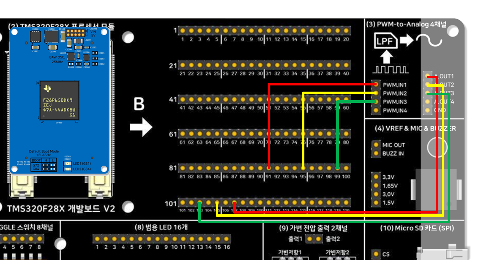

# TMS320F28X 개발보드 V2 — F28P65x PWM-to-Analog 출력 3채널 예제

[TMS320F28X 범용 개발보드 V2](https://tms320f28x.co.kr/goods/goods_view.php?goodsNo=200903127)의
회로블록 **(3) PWM-to-Analog 출력 4채널**을 F28P65x 모듈로 구동하는 예제입니다. 240포인트
사인 룩업 테이블로 120도 위상차를 가진 3상 사인파(SPWM) 3채널을 발생시키고, 저역통과필터를
거친 아날로그 출력을 ADCINA2/A3/A4로 되읽어(feedback) 실시간 검증합니다. 같은 동작을 세 가지
방식으로 각각 구현해서 코드량·메모리 사용량을 비교할 수 있게 만들었습니다.

## 포함된 프로젝트

| 프로젝트 | 설명 |
|---|---|
| [3_PWM_to_Analog_3Ch_Bitfield](3_PWM_to_Analog_3Ch_Bitfield/) | 레지스터 비트필드 직접 제어 (DriverLib 미사용) |
| [3_PWM_to_Analog_3Ch_Driverlib](3_PWM_to_Analog_3Ch_Driverlib/) | TI DriverLib 사용 |
| [3_PWM_to_Analog_3Ch_Freertos](3_PWM_to_Analog_3Ch_Freertos/) | FreeRTOS 태스크로 구현 (정적 할당, 힙 미사용) |

각 폴더는 자기완결형(self-contained) CCS 프로젝트입니다 — 폴더 하나만 받아도 C2000Ware/
DriverLib 등 필요한 파일이 전부 로컬에 포함되어 있어 Import → Build가 됩니다. EPWM8 주기
인터럽트 기반 ADC 오버샘플링, OTP trim 로드(`AdcSetMode()`), AIO 아날로그 스위치 설정까지
각 폴더의 README.md "동작 방식" 절에서 자세히 설명합니다. 실측 메모리 비교도 각 폴더의
README.md를 참고하세요.

## 배선

개발보드 B Side 핀-헤더와 보드의 **(3) PWM-to-Analog 4채널** 블록을 점퍼 와이어로 연결하세요
(세 프로젝트 모두 동일한 배선을 공용합니다):

| 채널 | PWM 출력 (B Side) | PWM-to-Analog 입력 단자 | PWM-to-Analog LPF 출력 단자 | ADC 되먹임 입력 (B Side) |
|---|---|---|---|---|
| **1채널 (U상)** | **B Side 91번** (GPIO213, EPWM8A) | ──▶ **`PWM.IN1`** | **`A.OUT1`** ──▶ | **B Side 107번** (ADCINA2 / AIO229) |
| **2채널 (V상)** | **B Side 95번** (GPIO211, EPWM14A) | ──▶ **`PWM.IN2`** | **`A.OUT2`** ──▶ | **B Side 105번** (ADCINA3 / AIO230) |
| **3채널 (W상)** | **B Side 99번** (GPIO209, EPWM12A) | ──▶ **`PWM.IN3`** | **`A.OUT3`** ──▶ | **B Side 103번** (ADCINA4 / AIO231) |

## 프로세서 모듈

- [TMS320F28P650DK9 모듈(산업용)](https://tms320f28x.co.kr/goods/goods_view.php?goodsNo=200903200)
- [TMS320F28P659DK8-Q1 모듈(차량 전장용)](https://tms320f28x.co.kr/goods/goods_view.php?goodsNo=200903201)

## 개발 환경

CCS 21.x(Theia 기반) / TI CGT 22.6.3.LTS / C2000Ware 26.00.00.00

## Import 방법 (zip 직접 import도 지원)

압축을 미리 풀어서 "Select search-directory"로 지정하거나, GitHub에서 받은 zip 파일을
그대로 CCS의 "Select archive file"로 지정해도 됩니다 — 둘 다 정상 동작합니다
(`driverlib.lib`가 zip-import 시 unresolved로 뜨던 버그를 고쳤습니다).
